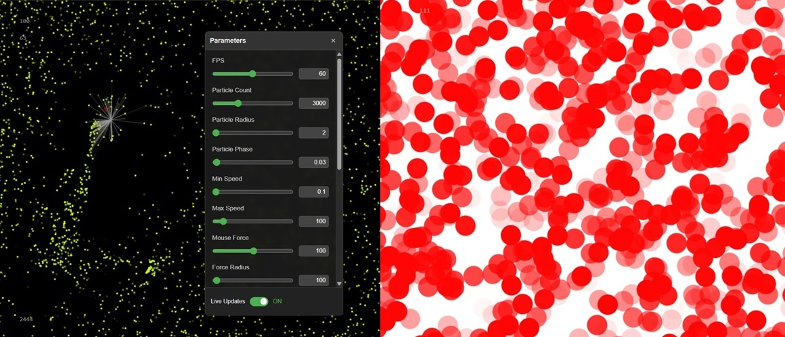

# js-particles

**js-particles** is an experimental particle simulation playground project.
It is written in JavaScript and controlled through a React GUI.

[Try it here!](https://2-rec.github.io/js-particles/)




## Context

The project was originally created as part of my [IT portfolio website](https://2-rec.github.io/it-portfolio), to serve as an interactive background for the "Services" section of the homepage.
As the simulation evolved and became more complex, it was moved into its own standalone repository to allow easier development, testing, and iteration.

As the complexity grew, using hardcoded parameters quickly became inconvenient for experimenting different configurations.
To enable real-time adjustments and rapid testing, a control GUI was added.

Despite the addition of the graphical interface layer, the project maintains a strict separation between:
* The core JavaScript simulation engine
* The React control GUI

This architectural design preserves the original goal of the project to keep the simulation engine fully independent and easily embeddable in other web pages or applications, whether as an interactive background or as part of a more complex visual system.


## Overview

The project separates concerns cleanly between:

* A **pure JavaScript particle simulation engine**
* A **React GUI layer** for real-time parameter control
* A **bridge layer** connecting UI state to the simulation without tightly coupling them

This architecture makes the simulation easy to extend, control, and refactor.


## Features

### Simulation Engine

* High-performance particle engine
* Mouse interaction with configurable force, radius, and behavior
* Particle lifecycle management (spawn, death, respawn)
* Configurable visual properties

### React GUI

* Draggable floating control panel
* Real-time parameter editing
* Automatic controls generation from configuration (color pickers, sliders and toggles)

### Data Flow Architecture

* Clean separation between engine and UI
* Bridge-based synchronization layer
* Two update modes:
    * Live Updates: real-time individual changes
    * Manual Updates: on demand batch changes


## Technologies Used

* JavaScript (ES6+)
* React
* HTML5 Canvas
* CSS3
* npm + Next.js for deployment


## Usage

### Panel Interaction

* **Open Panel:** Press `ENTER` or `SPACE`.
* **Close Panel:** Press `ESC` or click the "×" button in the top bar.
* **Move Panel:** Grab and drag the top bar (header) to reposition the GUI anywhere on the screen.

### Update Logic

* **Live Updates (ON):** Every change to a control parameter is pushed immediately to the simulation.
* **Live Updates (OFF):** Changes remain local to the GUI, allowing to stage multiple adjustments. Clicking the "Update" button apply all changes simultaneously.


## Control Parameters

The simulation is controlled by a series of parameters:

* **FPS**: Target frame rate.
* **Particle Count**: Total number of particles.
* **Particle Radius**: Size of particles.
* **Particle Phase**: Transparency oscillation speed. Controls how quickly particles fade in and out.
* **Min Speed / Max Speed**: Movement speed range.
* **Particle Lifespan**: Duration of dead particles. Defines how many updates a particle remains visible before being removed from the simulation.
* **Respawn Particles**: Enable/disable respawning. Determines if particles are recreated when they "die" or when they exit the canvas boundaries.
* **Mouse Force**: Determines the strength of the force the mouse exerts on nearby particles. A positive values attract particles, negative values repel them.
* **Force Radius**: Distance of mouse influence.
* **Force Increase**: Determines force behavior. If enabled, particles move faster the closer they are to the mouse, and if disabled, they move faster when further away.
* **Contact Radius**: Collision detection distance, triggering particle's "death" and transition to the dead state.
* **Mouse Particle**: A toggle to render a visual indicator (a particle) at the mouse cursor's current position.
* **Draw Lines**: Toggles the visibility of connection lines drawn between the mouse cursor and particles within the force radius.
* **Line Width**: Connection line thickness.
* **Particle Color**: RGB color of particles.
* **Dead Particle Color**: RGB color of particles that have been killed and are in their fading lifespan phase.
* **Background Color**: RGB color of the background.


## Run Locally

```bash
git clone https://github.com/2-rec/js-particles.git
cd js-particles
npm install
npm run dev
```


## Integration

The engine was intentionally designed to be fully decoupled from the React GUI. As a result, it can operate independently using only standard HTML, CSS, and JavaScript.
This makes it ideal for use as an interactive background or as a visual component within a larger layout.

This guide explains how to integrate the standalone JavaScript particle simulation engine into a web page.

### Step-by-Step Integration Guide

#### 1. Define the HTML Structure

Create an `index.html` file containing the DOM elements expected by the engine:

* Add a root wrapper:
  ```html
  <div id="container"></div>
  ```
  This element ensures proper CSS positioning and canvas scaling.

* Inside the container, include:
  * A `<canvas>` element with `id="particles_canvas"`
  * Optional HUD elements:
    * `particles_counter` (particle count display)
    * `display_fps` (render FPS)
    * `logic_fps` (logic FPS)

> Note: If either `display_fps` or `logic_fps` is missing, both FPS counters will be ignored.

#### 2. Prepare Required Files

From the `/src/simulation` directory:
* Copy `particles.js` into the same directory as `index.html`
* Copy `particles.css` into the same directory (or merge its content into an existing stylesheet)

The CSS can of course be modified to match the project's design.

#### 3. Link the Stylesheet

Include the stylesheet inside the `<head>` of the HTML file:
```html
<link rel="stylesheet" href="particles.css">
```
This ensures the canvas and HUD elements display as expected.

#### 4. Initialize the Simulation

Add a `<script type="module">` block at the end of the `<body>` to:
1. Import `initSimulation` from `particles.js`
2. Call it with a configuration object containing the desired parameter values

The configuration object can be hardcoded if no runtime updates are required.

#### 5. Optional: Lifecycle Management

If needed, expose and use the `cleanup` function to properly remove the simulation from the page.

The function removes registered window event listeners and cancels the active animation frame.
It is useful when dynamically mounting or unmounting the engine in a larger application.

### Example

The `index.html` file acts as the entry point.
It defines the required DOM elements and initializes the simulation with a configuration object.

```html
<!DOCTYPE html>
<html lang="en">
<head>
    <meta charset="UTF-8">
    <meta name="viewport" content="width=device-width, initial-scale=1.0">
    <title>Particle Simulation</title>
    <!-- CSS for layout and HUD elements -->
    <link rel="stylesheet" href="particles.css">
</head>
<body>
    <!-- main simulation container -->
    <div id="container">
        <!-- canvas rendering the particles -->
        <canvas id="particles_canvas"></canvas>

        <!-- optional particles counter -->
        <div id="particles_counter">00</div>

        <!-- optional FPS counters (both or none) -->
        <div id="display_fps">00</div>
        <div id="logic_fps">00</div>

        <!-- restart button (appears when no particles left) -->
        <button id="particles_button" style="display: none;">
            Restart Simulation
        </button>
    </div>

    <!-- bootstrap the simulation -->
    <script type="module">
        import { initSimulation } from './particles.js';

        /* simulation parameters */
        const simConfig = {
            FPS: 60,
            PARTICLE_COUNT: 2500,
            PARTICLE_RADIUS: 2.5,
            PARTICLE_PHASE: 0.04,
            PARTICLE_MIN_SPEED: 0.5,
            PARTICLE_MAX_SPEED: 80,
            MOUSE_FORCE: 120,
            FORCE_RADIUS: 150,
            FORCE_INCREASE: true,
            CONTACT_RADIUS: 30,
            PARTICLE_LIFESPAN: 5,
            PARTICLES_RESPAWN: false,
            MOUSE_PARTICLE: true,
            DRAW_LINES: true,
            LINE_WIDTH: 0.5,
            PARTICLE_COLOR: { r: 0, g: 255, b: 200 },
            DEAD_PARTICLE_COLOR: { r: 255, g: 50, b: 50 },
            BACKGROUND_COLOR: { r: 10, g: 10, b: 25 }
        };

        const simulation = initSimulation( simConfig );

        // optional: expose cleanup
        window.stopSimulation = () => {
            simulation.cleanup();
            console.log("Simulation cleaned up.");
        };
    </script>
</body>
</html>
```


## Future Improvements

Potential enhancements include:

* Preset management (save/load configurations)
* Mobile support
* Performance optimizations
* Additional particle behaviors
